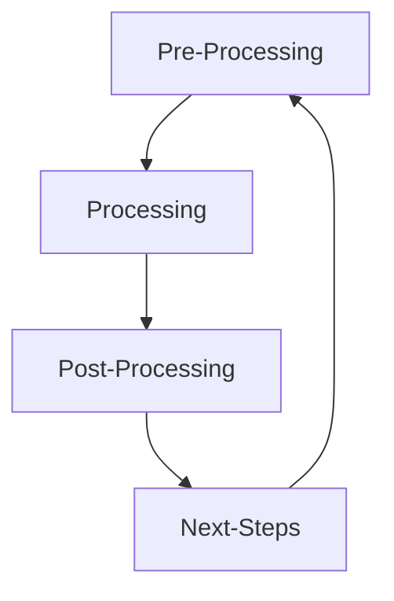

# Analysis Of Drones in Harsh Environmental Conditions using CFD and FEA
## Table of contents

* [Description](#description)
* [Essential Knowledge Required](#essential-knowledge-required)
* [Softwares Used](#softwares-used)
* [How To Conduct Simulations](#how-to-conduct-simulations)
* [Upcoming Tasks](#upcoming-tasks)

## Description 
Computational Fluid Dynamics(CFD) and Finite ELement Analysis(FEA) is applied to simulate drones in harsh environmental conditions. This is to understand the airflow around drones as well as analyse internal stresses developed within the propellers of the drones. It is done with the aim of conducting virtual tests before physical testing.In this case, a coaxial drone model is used as shown below.Steady state CFD simulations are done on the coaxial drone to understand effects of wind gusts on the drone body. As a follow up, stress analysis and modal analysis are done on the drone to analyse internal stresses in the drone and pinpoint frequencies where there is instability in the drone respectively.

  

## Essential Knowledge Required
* General CFD workflow
* General FEA workflow
* Discretization--> Finite Element Method(FEM) and Finite Volume Method(FVM) (Basic)
* Aerodynamics of Quadcopters and Coaxial Drones (Basic)
* Internal Stresses and Strains (Basic)
* Fluid Mechanics (Basic) 
* Forces and Moments/Torques 
* Moment of Inertia
* Angular Kinematics (Basic)  
* Natural Frequencies and Resonance (Basic) 

## Softwares Used 
* [Autodesk CFD 2021](https://knowledge.autodesk.com/support/cfd)
* [Autodesk Fusion 360](https://www.autodesk.com.sg/products/fusion-360/overview?term=1-YEAR&tab=subscription)
* [OpenFoam](https://www.openfoam.com/) 
* [FreeFem](https://freefem.org/) 

## How to Conduct Simulations
### Workflow of CFD Simulations 

#### Pre-Processing 
* Geometry used in simulations are prepared by removing any unwanted material/holes/edges  
* Depending on scenario, boundary conditions and initial conditions are defined 
* Domain is discretized, mesh independence study to be conducted

#### Processing 
* Solvers are selected based on simulation requirements 
* Turbulence Models are selected based on simulation requirement--> typically k-epsilon
* Select Time Step using Courant-Freidrichs-Lewy(CFL) criterion(for transient simulations) 
* Monitor values of residuals and variables of interest 

#### Post-Processing 
* Observe velocity distribution by using **Paraview** 
* Obtain forces and torques acting on drones from simulation
* Validate results by using research papers to compare  

#### Next Steps 
1. Obtain moment of inertia of drone about each global axia(x, y and z) 
2. Use angular kinematics equations to calculate the angular acceleration drone experiences due to the torque. 
3. Calculate degrees of rotation about each axis, θ, using angular acceleration 
4. Rotate the drone accordingly and repeat the same steps for the simulations using the new orientation

### Workflow of FEA Simulations 
Workflow of FEA Simulations is similar to that of CFD's.

#### Pre-Processing 
* Prepare geometry by simplifying 3d model i.e. remove unwanted components, holes, small edges 
* Assign materials to different parts of the model (different materials have different **Yield Strengths**) 
* Define constraints on model to control degree of freedom(Translation & Rotation) of components 
* Define structural loads on model 
* Discretize domain using FEM

#### Processing 
* Run the simulation, unlike CFD, FEA does not contain different solvers. Depending on softwarees used, different studies i.e. static stress analysis, modal analysis or transient analysis will have different solutions

#### Post-Processing
* Observe safety factor of model and ensure it is > 1.5 
* Observe areas of stress concentration and conclude why 
* Research and validate using results from research papers

## Upcoming Tasks
* Complete Mesh independence study for Coaxial drone (either automatically by writing a script or manually refining mesh)
* Complete Source codes for Steady State CFD simulations of Coaxial Drone 
* Complete Source code for Stress and Modal Analysis of Coaxial Drone  

## Useful Resources
* [CFD Lecture Videos](https://www.youtube.com/@fluidmechanics101) 
* [My Beginner CFD and FEA Notes](https://docs.google.com/document/d/1XW_Lc4cf8SOezIlxcTdriGmZuJqpQ40c5-uJfjIPsYc/edit?usp=sharing)  
* [OpenFOAM Tutorials](https://www.openfoam.com/documentation/tutorial-guide) 
* [FreeFEM Tutorials](https://doc.freefem.org/tutorials/index.html#tutorial) 
* [Natural Frequencies and Resonance Lecture](https://www.youtube.com/watch?v=5I67zUzhv6Q) 

 
