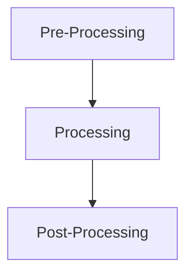

# Analysis Of Drones in Harsh Environmental Conditions using CFD and FEA
## Table of contents

* [Description](#description)
* [Essential Knowledge Required](#essential-knowledge-required)
* [Softwares Used](#softwares-used)
* [How To Conduct Simulations](#how-to)
* [Current Features](#current-features) 
* [Upcoming Features](#upcoming-features)  
* [How to Contribute](#how-to-contribute)

## Description 
Computational Fluid Dynamics(CFD) and Finite ELement Analysis(FEA) is applied to simulate drones in harsh environmental conditions. This is to understand the airflow around drones as well as analyse internal stresses developed within the propellers of the drones. It is done with the aim of conducting virtual tests before physical testing. 

## Essential Knowledge Required
* General CFD workflow
* General FEA workflow
* Discretization--> Finite Element Method and Finite Volume Method (Basic)
* Aerodynamics of Quadcopters and Coaxial Drones (Basic)
* Internal Stresses and Strains (Basic)
* Fluid Mechanics (Basic) 
* Forces and Moments 
* Angular Kinematics (Basic) 

## Softwares Used 
* Autodesk CFD 2021
* Autodesk Fusion 360 
* OpenFoam 
* FreeFem 

## How to 
### Workflow of CFD Simulations 

### Pre-Processing 
* Geometry used in simulations are prepared by removing any unwanted material/holes/edges  
* Depending on scenario, boundary conditions and initial conditions are defined 
* Domain is discretized, mesh independence study to be conducted

### Processing 
* Solvers are selected based on simulation requirements 
* Turbulence Models are selected 
* Time Step size selected (for transient simulations) 
* Monitoring values of residuals and variables of interest 

### Post

## Current Features 
Steady State Simulations of Coaxial Drone 

## Upcoming Features 
## How to Contribute

 
